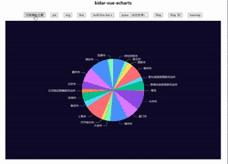

<h1 align="center">kidar-echarts 🍥 更简单的Echarts</h1>

<p align="center">
  将必要有关联的配置属性进行封装，仅暴露用户可能自定义的配置选项，无需关注自适应、鼠标点击事件等操作，支持自定义插件，更好的复用配置
</p>

<p align="center">
 具体可点击查看在线示例 ✨ <a href="https://kidarjs.github.io/kidar-vue-examples/">Live Demo</a>
</p>

# Why
由于使用原生Echarts,option配置项太多，很容易遗漏犯错，当项目中图表很多时，类似的图表很难复用，抽取组件也很麻烦。

频繁的编写option很痛苦，属性多得记不住，总是需要查看文档来进行配置

因此更贴合Vue使用者习惯的 kidar-vue-echarts 组件，将会给你带来更舒适的编码体验，减少了echarts的学习成本。

kidar-vue-echarts为了解决这个问题，将大家常用的option进行收集封装，通过懒加载的方式展现，减少echarts配置的学习成本。
并且支持自定义option文件，并通过添加插件的方式导入，方便复用。同时你也可以寻找社区分享的好用的option进行安装使用，我们仅需要关注图表所需数据格式、维度，就能画出漂亮的图表了。

# Now
目前组件还再完善中，也欢迎大家点评，如果你觉得这个组件还不错，也欢迎贡献代码，扩充更多好看的plugin

# 🔥 Features
每个组件实例都是一个echarts，切换不同的echarts采用懒加载技术，更快更简单的实现不同图形的展示

- [x] 快速绘制出简单图形，饼图、折线、柱状、环形、多样组合、地图
- [x] 支持自定义插件
- [x] 支持自适应宽高，当容器大小变化时自动适应
- [x] 支持IE11
- [x] 支持Typescript
- [ ] 支持自定义参数，方便定制tooltip、label等
- [ ] 支持点击事件、鼠标移入移出事件
- [ ] 支持3D

# 效果图预览




# 涉及的技术
* vite
* vue2
* typescript

# 🚀 Getting started

## Install

```bash
npm install kidar-echarts
```

## Development

1. new .vue file
2. copy these codes 
3. run it

```vue
<template>
  <!-- 注意，容器的初始宽高需要定义，不然看不到 -->
  <kidar-echarts type="multi-line-bar-x" :data="data" :cols="cols" style="height: 400px; width: 100%" />
</template>
<script>
import { KidarEcharts } from 'kidar-vue-echarts'
export default {
  components: { KidarEcharts },
  data(){
    return {
      cols: [
        {name: '折线', color: '#1890ff', type: 'line'},
        {name: '柱子', color: '#ff90ff', type: 'bar'}
      ],
      data: [
        {name: '2020-01', value: 123},
        {name: '2020-02', value: 456},
        {name: '2020-03', value: 789},
        {name: '2020-04', value: 123}
      ]
    }
  }
}
</script>
```


## 添加自定义插件 Add Plugin 

```ts
// main.ts
import { KidarEcharts } from 'kidar-echarts'

import barX from "./plugins/barX";

KidarEcharts.addPlugin(barX)

```

```ts
// barX.ts 推荐使用 ts + defineConfig 更友好的提示，提前规避编码错误
import { defineConfig } from 'kidar-echarts'

export default defineConfig({
  name: 'barX', // 此处的name属性，将用于组件的属性type
  resetOption(cols, data, ctx) {
    return {
      yAxis: [{
        type: 'value'
      }],
      xAxis: [{
        type: 'category',
        data: data.map(t => t.name)
      }],
      series: [
        {
          type: 'bar',
          data: data
        }
      ]
    }
  }
})

```

